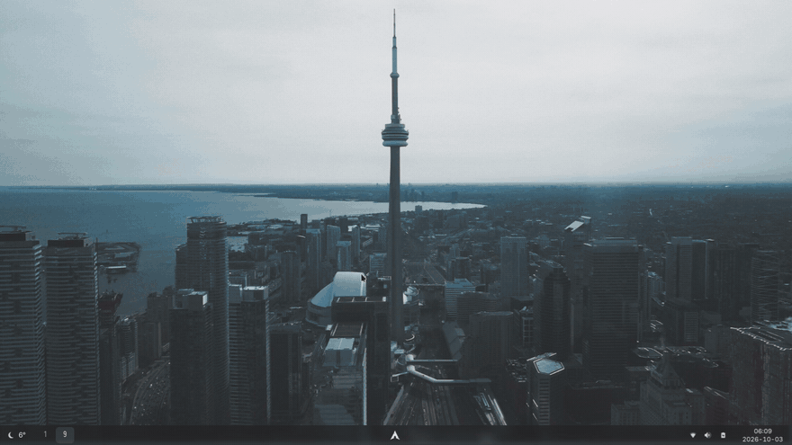

# dotfiles



A Windows 11–style desktop for Arch Linux, built on Sway (Wayland): a taskbar with a Start menu, Quick settings, notifications, weather and a lock screen, with blur and rounded corners. Colours are generated from your wallpaper.

The previous bspwm/X11 setup lives in [litework/dotfiles-archive](https://github.com/litework/dotfiles-archive).

## Install it (step by step)

You don't need to know Linux well to do this. It takes about an hour, mostly waiting.

### 1. What you need

- A computer to install on. **Everything on it will be erased**, so back up your files first.
- A USB stick (2 GB or more; it will be erased too).
- An internet connection. A network cable is easiest; Wi-Fi works too.

### 2. Install Arch Linux

1. Download the Arch Linux ISO from <https://archlinux.org/download/>.
2. Write it to the USB stick with [balenaEtcher](https://etcher.balena.io/) or [Rufus](https://rufus.ie/) (Windows).
3. Plug the USB stick into the computer, turn it on, and pick the USB stick from the boot menu
   (usually by pressing `F12`, `F2`, `Esc` or `Del` right after switching on).
4. When you see a text prompt (`root@archiso`), connect to the internet:
   - **Cable:** nothing to do.
   - **Wi-Fi:** type `iwctl`, then `station wlan0 connect "Your Network Name"`, enter the password, then `exit`.
5. Type `archinstall` and press Enter. Use the arrow keys and Enter to set:
   - **Disk configuration:** use a best-effort default layout on your drive.
   - **Authentication → User account:** add a user, give it a password, and answer **yes** to making it a *superuser (sudo)*.
   - **Profile:** `Minimal`.
   - **Audio:** `Pipewire`.
   - **Network configuration:** `Use NetworkManager`.
   - **Timezone:** your timezone.
   - Leave everything else as it is, choose **Install**, and confirm.
6. When it finishes, choose to reboot and remove the USB stick.

### 3. Install this desktop

1. Log in with the username and password you created. You'll get a text screen; that's expected.
2. If you're on Wi-Fi, connect: type `nmtui`, choose **Activate a connection**, pick your network, enter the password, then quit.
3. Type these three lines, pressing Enter after each:

   ```sh
   sudo pacman -S git
   git clone https://github.com/litework/dotfiles ~/dotfiles
   ~/dotfiles/install.sh
   ```

   Enter your password when asked. The installer prints what it's doing; let it run until it says **All done!**
4. Restart: type `sudo reboot`.

The computer now starts straight into the desktop.

### 4. First steps

- **`Super`** is the Windows key. **`Super + Space`** opens Start; **`Super + Enter`** opens a terminal.
- Click the **Wi-Fi / volume / battery icons** (bottom right) for Quick settings, the **clock** for the calendar and notifications, and the **weather** (bottom left) for the forecast.
- **Wallpaper:** Start → ⚙ Settings → Personalization. Everything recolours to match.
- **Your city** (for weather, night light and light/dark mode): edit `~/.config/location.conf`, for example with `nvim ~/.config/location.conf` (`i` to type, `Esc` then `:wq` to save).
- **Lock the screen:** `Super + Shift + Esc`.

### Fonts

The terminal and taskbar use [PragmataPro](https://fsd.it/shop/fonts/pragmatapro/), a paid font. Without it a free font is used automatically. If you own it, put your `otf-pragmata*.pkg.tar.*` package in your home folder and run `~/dotfiles/install.sh` again.

### If something goes wrong

- **The installer stopped with an error:** fix the problem it mentions (often the internet connection) and run `~/dotfiles/install.sh` again. It's safe to run more than once.
- **The desktop doesn't start, or is slow:** press `Ctrl + Alt + F2`, log in, and run `swayfx-revert`. That switches to plain sway without blur, then `sudo reboot`.
- **A red screen when unlocking:** press `Ctrl + Alt + F2`, log in, run `WAYLAND_DISPLAY=wayland-1 swaylock`, press `Ctrl + Alt + F7`, and type your password.

## What's inside

| Role         | Program                                   | Replaced                 |
|--------------|-------------------------------------------|--------------------------|
| Compositor   | `swayfx` (sway + blur, rounded corners, shadows; AUR) with `swayidle`, `swaybg` | `bspwm` + `sxhkd`, `compton` |
| Taskbar      | `waybar`, Windows 11 layout: weather · workspaces · Start + open windows · tray, status icons, clock | `polybar` / `lemonbar`   |
| Shell UI     | `quick-panel` (GTK4 + layer-shell): Start menu with search and calculator, Quick settings, Wi-Fi/Bluetooth/Sound/Night light pages, Settings, calendar with notifications, weather, clipboard history; Bluetooth pairing agent | blueman, rofi menus |
| Lock screen  | `gtklock` (falls back to `swaylock`)       | `swaylock`               |
| Notifications| `mako`                                    | —                        |
| Terminal     | `foot` (server + `footclient`)            | `urxvt` / `urxvtd`       |
| Shell        | `zsh` + `starship`, `fzf`, `zoxide`, `eza` | `powerlevel9k`           |
| Editor       | `neovim` (Lua, `vim.pack`, LSP, Treesitter) | `vim` + vim-plug         |
| Colours      | `wallust`                                 | `pywal`                  |
| Icons        | Papirus                                   | Adwaita                  |
| Light/dark   | `appearance`: follows sunrise/sunset, or manual; gsettings + `xsettingsd` | always dark |
| Files        | `yazi`, Thunar                            | `ranger`                 |
| Music        | `mpd` + `ncmpcpp`                         | —                        |
| Network      | NetworkManager                            | dhcpcd + wpa_supplicant  |
| Audio        | PipeWire (`wireplumber`, `wpctl`)         | PulseAudio               |
| Screenshots  | `grim` + `slurp`                          | `scrot`                  |
| Login        | LightDM with auto-login to sway           | LightDM → bspwm          |

Each top-level directory is a [GNU Stow](https://www.gnu.org/software/stow/) package mirroring `$HOME`; `system/` holds files copied to `/etc` (TLP, reflector). `install.sh` installs packages (pacman, then yay for SwayFX and Edge, cargo for wallust), backs up conflicting files to `~/.dotfiles-backup/`, links everything with `stow --no-folding`, enables services and sets up LightDM auto-login.

## Maintenance

- SwayFX comes from the AUR. If it misbehaves, `swayfx-revert` reinstalls plain sway from the package cache and disables `fx.conf`.
- `wallust` comes from crates.io (the AUR package's checksum is broken); update it with `cargo install --locked wallust`.
- Neovim plugins are pinned in `nvim/.config/nvim/nvim-pack-lock.json`; update with `:lua vim.pack.update()` and commit the lockfile.
- `paccache.timer` trims the package cache and `reflector.timer` refreshes mirrors weekly; TLP handles power saving.
- `docs/record-demo.sh` re-records the demo GIF.

## Keys

`Super` is the Windows key.

| Keys | Action |
|------|--------|
| `Super+Return` / `Super+Space` | terminal / Start menu |
| `Super+v` | clipboard history |
| `Super+Shift+Esc` / `Super+x` | lock / power menu |
| `Super+h/j/k/l` (`+Shift`) | focus (move) window |
| `Super+1…0` (`+Shift`) | workspace (move window to it) |
| `Super+;` / `Super+'` / `Super+Tab` | prev / next / last workspace |
| `Super+Ctrl+h/j/k/l` | split direction for next window |
| `Super+Alt+h/j/k/l` (`+Shift`) | grow (shrink) window |
| `Super+w` / `Super+m` / `Super+s` / `Super+f` | close / tabbed / float / fullscreen |
| `Super+-` / `Super+=` | shrink / grow gaps |
| `Super+F1` | scratchpad terminal |
| `Super+F2…F10` | yazi, thunar, edge, ncmpcpp, spotify, weechat, gimp, pavucontrol, qbittorrent |
| `Print` / `Shift+Print` | screenshot area / full screen |
| `Super+Esc` / `Super+Alt+Esc` | reload / exit sway |
